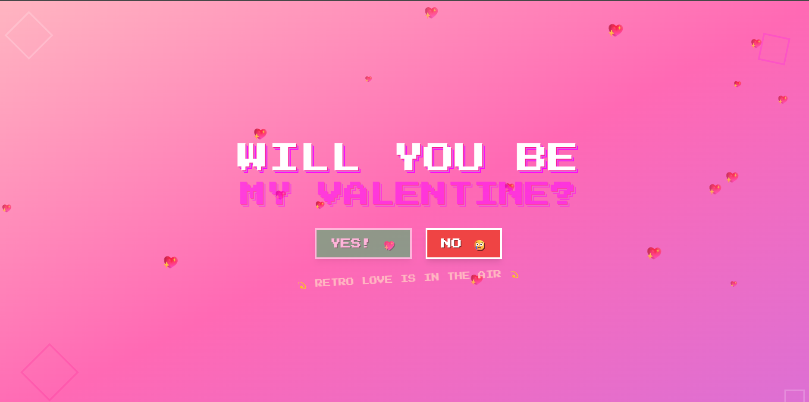

# 💖 Retro Valentine's Day Website

A fun, interactive Valentine's Day website built with React, Vite, and Tailwind CSS. Features a retro gaming aesthetic with a playful "No" button that runs away when you try to click it!

## ✨ Features


## 🚀 Getting Started

### Prerequisites


### Installation

1. Clone the repository
```bash
git clone <repository-url>
cd vlentines-day-website
```

2. Install dependencies
```bash
npm install
```

3. Start the development server
```bash
npm run dev
```

4. Open your browser and visit `http://localhost:5173`

### Building for Production

```bash
npm run build
```

The built files will be in the `dist` directory.

## 🛠 Tech Stack


## 💝 How It Works

The website presents a simple question: "Will you be my Valentine?" with two buttons:


The retro gaming aesthetic includes:

## 📱 Deployment

This project is configured for easy deployment on Vercel:

1. Connect your GitHub repository to Vercel
2. Vercel will automatically detect it as a Vite project
3. Your site will be deployed with every push to main

## 🎮 Customization

You can easily customize the website by:


## 💖 Perfect For


Made with 💖 and lots of retro gaming nostalgia!

# Valentines Day Website

A fun and interactive web application for Valentine’s Day, built with React and styled using Tailwind CSS. The site features animated hearts, a success modal, and a modern responsive design. Built with Vite for fast development and optimized builds.

## Features

- **Animated Hearts:** Floating and interactive heart animations for a festive feel.
- **Success Modal:** Displays a modal on successful actions or submissions.
- **Responsive Design:** Looks great on all devices, from mobile to desktop.
- **Fast Build & Hot Reload:** Powered by Vite for instant feedback during development.
- **Easy Deployment:** Ready for deployment on Vercel or any static hosting provider.

## Getting started

### 1. Clone the repository

```bash
git clone https://github.com/Benjaminax/vlentines-day-website.git
cd vlentines-day-website
```

### 2. Install dependencies

```bash
npm install
```

### 3. Configure environment variables (if applicable)

This project does not require environment variables by default. If you add any, follow this pattern:

```bash
cp .env.example .env
```

If you are on Windows PowerShell:

```powershell
Copy-Item .env.example .env
```

Required variables in `.env` (if needed):

```env
VARIABLE_ONE=your-value-here
VARIABLE_TWO=your-value-here
```

### 4. Run the application

```bash
npm run dev
```

### 5. Build for production

```bash
npm run build
```

## API endpoints (if applicable)

This project does not expose any API endpoints by default.

## Dependencies

- **React:** UI library for building interactive interfaces.
- **Vite:** Fast build tool and development server.
- **Tailwind CSS:** Utility-first CSS framework for rapid UI development.

## Project structure

```
vlentines-day-website/
├── src/
│   ├── components/
│   │   ├── Hearts.jsx
│   │   └── SuccessModal.jsx
│   ├── screenshots/
│   │   └── image.png
│   ├── App.jsx
│   ├── index.css
│   └── main.jsx
├── index.html
├── package.json
├── tailwind.config.js
├── postcss.config.js
├── vite.config.js
├── README.md
└── ...
```

## Screenshots



## Socials

If you have any questions, you can reach me here:

- **Instagram:** [@_.benjamin.a._](https://www.instagram.com/_.benjamin.a._/)
- **GitHub:** [Benjaminax](https://github.com/Benjaminax/)
- **Email:** kojoben29@gmail.com

In God we trust